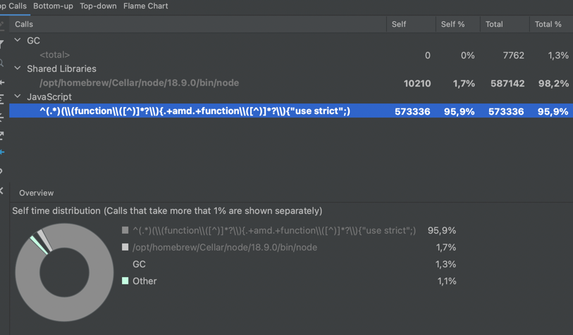

# Reproduce slow vite build

## Versions

```
System:
    OS: macOS 12.6
    CPU: (10) arm64 Apple M1 Max
    Memory: 103.55 MB / 64.00 GB
    Shell: 5.8.1 - /bin/zsh
Binaries:
    Node: 18.9.0 - /opt/homebrew/bin/node
    Yarn: 1.22.17 - /opt/homebrew/bin/yarn
    npm: 8.19.1 - /opt/homebrew/bin/npm
Browsers:
    Brave Browser: 107.1.45.118
    Chrome: 107.0.5304.110
    Firefox: 106.0.5
    Safari: 16.0
npmPackages:
    @vitejs/plugin-vue2: ^2.0.0 => 2.0.1
    vite: ^3.2.0 => 3.2.3
```

## Steps to reproduce

Set up a Vue+Vite project with lots of heavy dependencies and build it as a `umd` library. This repo is an example where the use of such dependencies leads to a large output file (7558.89 KiB in this case).

1. `git clone https://github.com/Flynamic/vite-reproduce-slow-regex && cd vite-reproduce-slow-regex`
2. `npm install`
3. `vite build`

You should see something like the following output after a very reasonable time:

```bash
vite v3.2.3 building for production...
transforming (1512) node_modules/lodash/_arraySome.js'isMoment' is not exported by 'node_modules/moment/dist/moment.js'
Use of eval is strongly discouraged, as it poses security risks and may cause issues with minification
✓ 1568 modules transformed.
dist/reproduce-slow-regex.mjs       0.08 KiB / gzip: 0.09 KiB
dist/purify.es.ffc53232.mjs         26.43 KiB / gzip: 8.96 KiB
dist/html2canvas.esm.7d71270f.mjs   243.24 KiB / gzip: 50.66 KiB
dist/index.es.480cf1ea.mjs          198.11 KiB / gzip: 55.36 KiB
dist/style.css                      452.48 KiB / gzip: 55.55 KiB
dist/main.960a87ea.mjs              8801.67 KiB / gzip: 1915.97 KiB
```

and after a very unreasonable time...

```bash
dist/reproduce-slow-regex.umd.cjs   7558.89 KiB / gzip: 1890.25 KiB
```

The project that I'm currently transforming had an output that is around 11 MB, and it takes 12 minutes.

## The source of the problem

Profiling the situation gives us this statistic:



This is the `INJECT_HELPERS_UMD_RE` regex used in `vite:esbuild-transpile`, defined [here](https://github.com/vitejs/vite/blob/ce4c8d4537285311e0ea5bb8d1c53df9fd779881/packages/vite/src/node/plugins/esbuild.ts#L32):

```javascript
const INJECT_HELPERS_UMD_RE =
  /^(.*)(\(function\([^)]*?\){.+amd.+function\([^)]*?\){"use strict";)/s
```

Most of the processing time seems to be consumed by running that regex.

Copying the output that is to be replaced and the regex to [regex101.com](https://regex101.com) indeed results in a "catastrophic backtracking" error.
